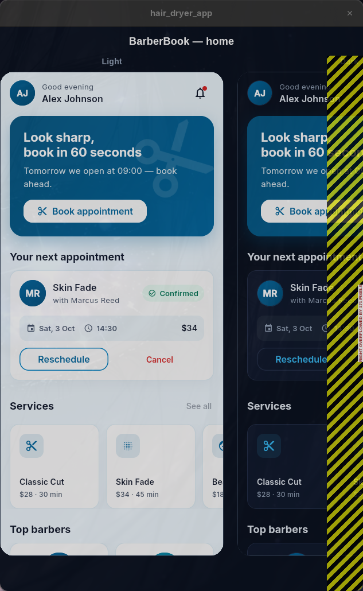
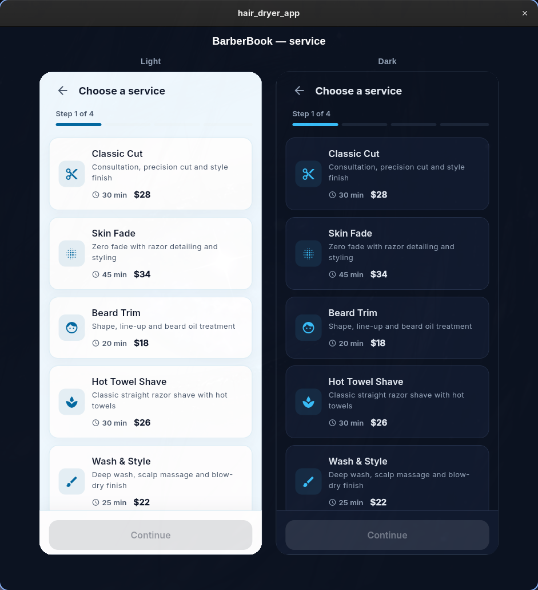
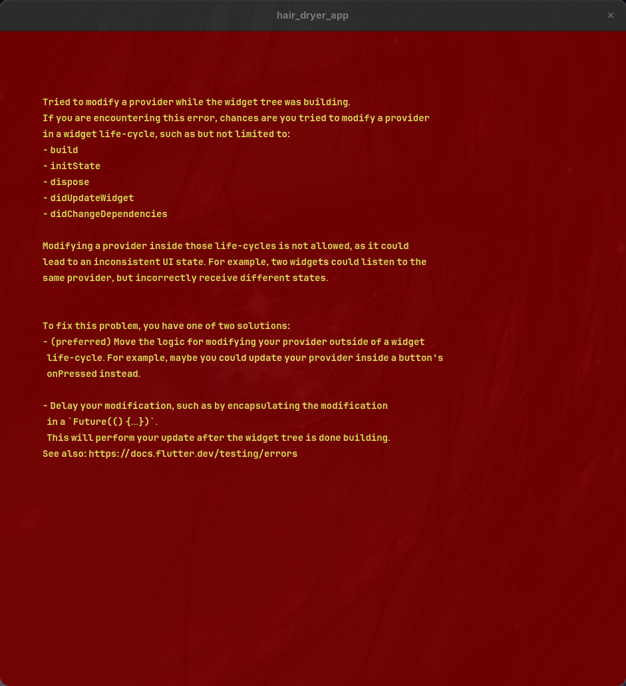
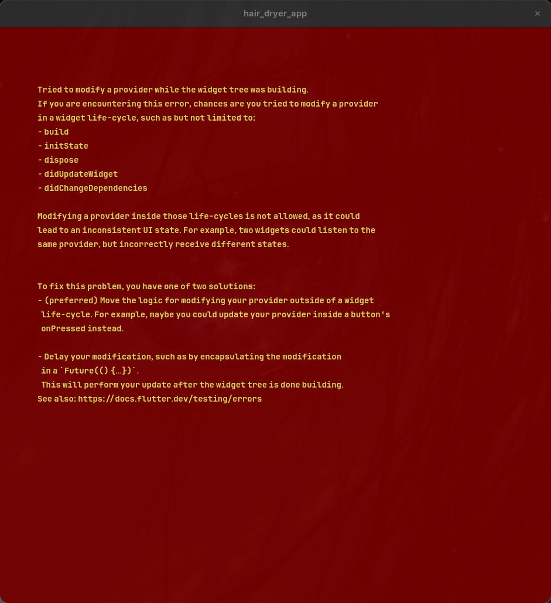
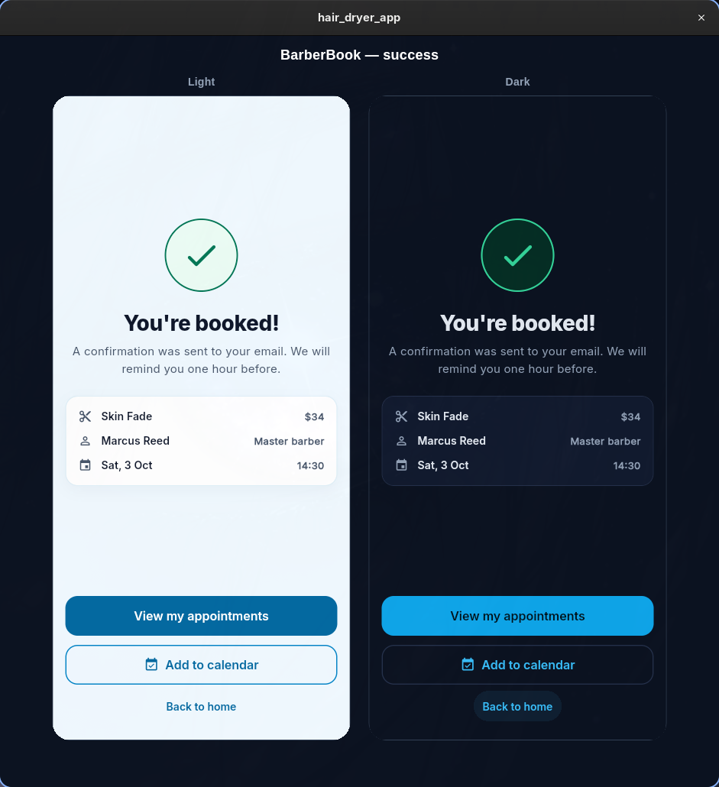
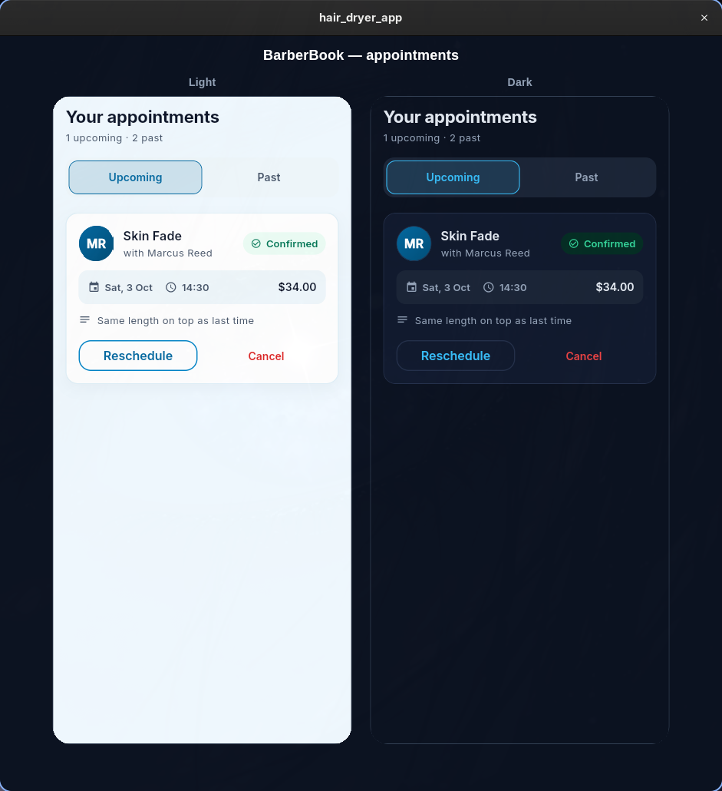
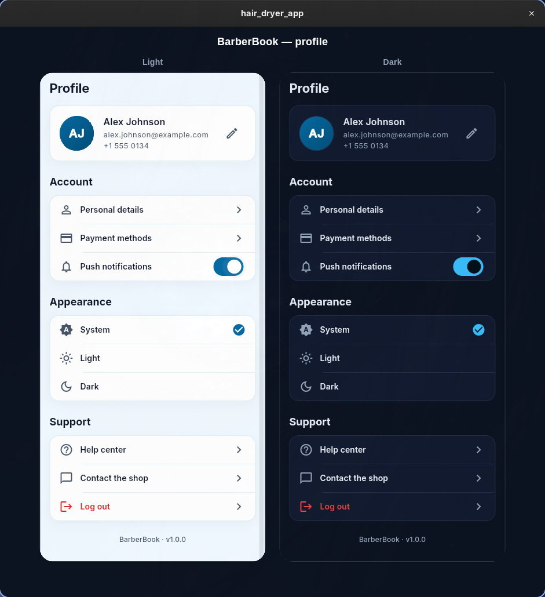

# BarberBook

A demo barber appointment booking app built with Flutter — service → barber → time →
review → confirm, plus appointments management and profile settings.

> **Portfolio showcase only.** This project does **not** talk to any real backend.
> Every "server" interaction (credentials, sessions, bookings) runs locally on-device,
> and appointment data is seeded mock content. It exists to demonstrate frontend
> architecture, state management, testing and UI skills — not to ship as a product.

| | | | |
|:-:|:-:|:-:|:-:|
|  |  |  |  |
|  |  |  |  |

## Features

- **Onboarding** — first-launch tutorial, remembered via local preference.
- **Auth** — sign in / sign up / continue as guest. Passwords are salted with
  PBKDF2-HMAC-SHA256 and stored in on-device Hive boxes; sessions expire after a TTL.
  (Local pattern demo — no server, no email verification, no password reset.)
- **Booking flow** — 5-step funnel with a persisted draft, validation at the review
  step, and a confirmation screen.
- **Appointments** — upcoming/past tabs, cancel with confirmation dialog, empty states.
- **Profile** — edit name/phone, switch theme (light/dark) and language (EN/TR).
- **Design system** — tokenized colors, spacing and radii; light + dark themes;
  primary button with gradient fill, colored glow, sheen and press animation.

## Tech stack

| Area | Choice |
|---|---|
| Framework | Flutter 3.47 / Dart ^3.13 |
| State | Riverpod 3 (Notifier/AsyncNotifier) + flutter_hooks |
| Routing | go_router with `StatefulShellRoute` tabs and session-based redirects |
| Error handling | `Either<Failure, T>` (fpdart) + freezed unions |
| Persistence | Hive (local "database"), shared_preferences |
| Codegen | build_runner, freezed, json_serializable, flutter_gen |
| i18n | flutter gen-l10n, ARB files (EN/TR) |
| Lints | `very_good_analysis` |
| Tests | 52 unit/widget tests (`flutter_test`) |

## Architecture

Feature-first layers; each feature under `lib/src/features/<name>/` owns
`presentation` → `application` → `domain` (+ `infrastructure` when needed):

```
UI (ConsumerWidget/HookWidget)
  → Notifier (pure state, no try/catch of I/O)
    → Repository  ← returns Either<Failure, T>, owns error translation
      → Service (thin I/O: Hive, SharedPreferences, mock API)
```

Rules the codebase follows:

- Services are dumb I/O; repositories are the only layer that catches and maps
  errors into typed `Failure`s.
- Notifiers expose state; UI reacts — errors never bubble as raw exceptions.
- No `setState`/`StatefulWidget`; widgets are hooks-based.
- No hardcoded strings or colors — `context.l10n.*` and `AppColors` tokens only.
- Routes are guarded by the auth session (`/auth` redirect logic in
  `lib/src/core/router/`).

```
lib/
├── main.dart
└── src/
    ├── app.dart                 # ProviderScope + router
    ├── core/                    # database, errors, l10n, router, theme, components
    └── features/
        ├── onboarding/  auth/  home/
        ├── appointments/  profile/  design_gallery/
```

## Getting started

```bash
flutter pub get
flutter run
```

Useful commands:

```bash
# code generation (freezed / json / riverpod / assets)
dart run build_runner build --delete-conflicting-outputs

# regenerate localizations
flutter gen-l10n

# verify
flutter analyze
flutter test

# design review harness: renders each screen in light + dark for screenshots
flutter run -t lib/src/features/design_gallery/design_gallery.dart -d linux
# pick a screen: BB_SCREEN=home|service|barber|time|review|success|appointments|profile
```

## Scope & non-goals

- **No backend** — no REST/GraphQL/Firebase; "persistence" is on-device Hive.
- **Mock domain data** — barbers, services and time slots come from a local mock
  service.
- **No payments, notifications or analytics.**
- Auth demonstrates hashing/session/expiry patterns locally only.

## Tests

`flutter test` runs 52 tests: repository rules against the local database,
auth notifier/session/failure behavior, sign-in/sign-up/guest UI flows,
router redirect matrix, and primary-button rendering (gradient, glow, disabled
state) — via a shared `AppHarness` widget test harness.
